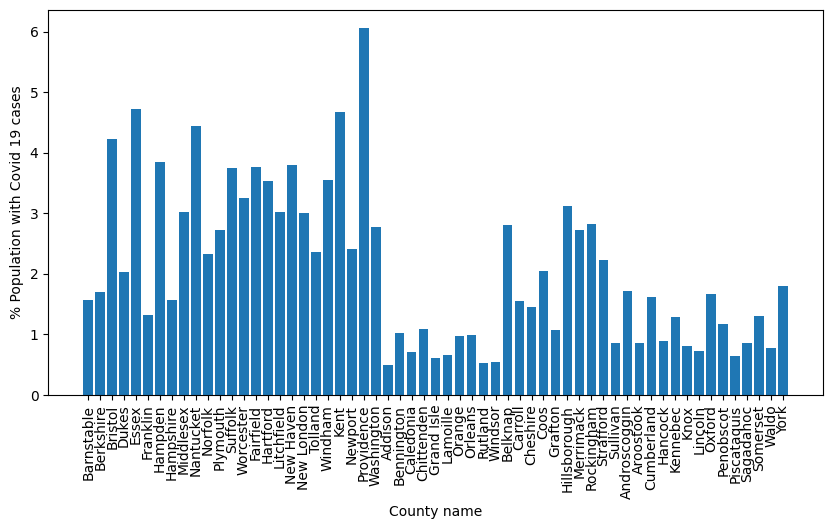

# ChE-Math-Project1: Covid-19 dependence on population of children and diversity index

### Influence of diversity index and population of children on Covid-19 cases in the New England region during holiday season 2020

#### Using Regression tools ( U test and Linear regression with interaction) to analyze county-wise data to answer the following questions:
1. Did counties with population of children higher than 18% have lower percentage of Covid-19 cases during the holiday season of the year 2020?

2. Did counties with diversity index higher than 25% have higher percentage of Covid-19 cases during the holiday season of the year 2020?

3. Were Covid-19 cases higher in counties with more than 18% population of children and diversity index greater than 25%?

